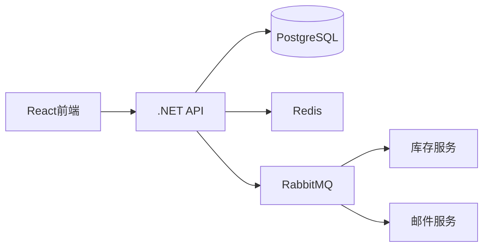

### **电商平台开发文档**  
**项目名称**: ShopSphere  
**技术栈**: React + TypeScript + .NET + PostgreSQL + Redis + RabbitMQ + Docker  

---

### **一、项目概述**  
#### **核心功能**  
- 用户注册/登录（JWT认证）  
- 商品管理（CRUD）  
- 购物车系统（Redis实现）  
- 订单流程（含支付沙箱集成）  
- 异步消息处理（RabbitMQ）  

#### **技术亮点**  
- 全容器化开发环境  
- 高并发库存管理（Redis原子操作）  
- 订单自动取消（RabbitMQ延迟队列）  

---

### **二、环境配置**  
#### **1. 开发环境启动**  
```bash
# 启动基础设施
docker-compose up -d postgres redis rabbitmq

# 启动后端（需先构建）
cd backend && dotnet run

# 启动前端
cd frontend && npm install && npm run dev
```

#### **2. Docker Compose配置**  
```yaml
# docker-compose.yml（精简版）
services:
  postgres:
    image: postgres:15
    environment:
      POSTGRES_PASSWORD: admin123
    volumes:
      - pg_data:/var/lib/postgresql/data

  redis:
    image: redis:7
    command: redis-server --requirepass redis123

  rabbitmq:
    image: rabbitmq:3-management
    environment:
      RABBITMQ_DEFAULT_USER: admin
      RABBITMQ_DEFAULT_PASS: rabbit123

volumes:
  pg_data:
```

---

### **三、架构设计**  


---

### **四、核心模块实现**  
#### **1. 用户认证（JWT）**  
**.NET JWT配置**  
```csharp
// Program.cs
builder.Services.AddAuthentication(JwtBearerDefaults.AuthenticationScheme)
    .AddJwtBearer(options => {
        options.TokenValidationParameters = new TokenValidationParameters {
            ValidateIssuerSigningKey = true,
            IssuerSigningKey = new SymmetricSecurityKey(
                Encoding.UTF8.GetBytes(builder.Configuration["JWT:Secret"])),
            ValidateIssuer = false,
            ValidateAudience = false
        };
    });
```

**React登录组件**  
```tsx
// Login.tsx
const handleSubmit = async (e: React.FormEvent) => {
  e.preventDefault();
  const { data } = await axios.post('/api/auth/login', {
    email, password
  });
  localStorage.setItem('token', data.token);
  navigate('/dashboard');
};
```

#### **2. 商品管理**  
**EF Core模型**  
```csharp
public class Product {
    public int Id { get; set; }
    [Required, MaxLength(100)]
    public string Name { get; set; }
    [Column(TypeName = "decimal(18,2)")]
    public decimal Price { get; set; }
    public int Stock { get; set; }
    [Column(TypeName = "jsonb")]
    public Dictionary<string, string> Attributes { get; set; }
}
```

**商品搜索API**  
```http
GET /api/products/search?q=phone
Response:
{
  "data": [
    {
      "id": 1,
      "name": "Smartphone",
      "price": 599.99,
      "stock": 100
    }
  ]
}
```

#### **3. 购物车系统**  
**Redis操作示例**  
```csharp
public class CartService {
    private readonly IDatabase _redis;
    
    public void AddItem(int userId, int productId, int quantity) {
        _redis.HashSet($"cart:{userId}", productId, quantity);
    }

    public Dictionary<int, int> GetCart(int userId) {
        return _redis.HashGetAll($"cart:{userId}")
            .ToDictionary(
                x => int.Parse(x.Name), 
                x => (int)x.Value
            );
    }
}
```

#### **4. 订单处理**  
**RabbitMQ生产者**  
```csharp
// 订单创建时发送消息
var message = JsonConvert.SerializeObject(new {
    OrderId = order.Id,
    TotalAmount = order.Total
});
var body = Encoding.UTF8.GetBytes(message);

_channel.BasicPublish(
    exchange: "orders",
    routingKey: "",
    basicProperties: null,
    body: body
);
```

**消费者服务**  
```csharp
// BackgroundService实现
protected override async Task ExecuteAsync(CancellationToken stoppingToken) {
    var consumer = new EventingBasicConsumer(_channel);
    consumer.Received += (model, ea) => {
        var body = ea.Body.ToArray();
        var message = Encoding.UTF8.GetString(body);
        // 处理订单逻辑
        _channel.BasicAck(ea.DeliveryTag, false);
    };
    _channel.BasicConsume("order_queue", false, consumer);
}
```

---

### **五、API参考**  
#### **用户模块**  
| 端点 | 方法 | 描述 |
|------|------|------|
| `/api/auth/register` | POST | 用户注册 |
| `/api/auth/login` | POST | 用户登录 |
| `/api/users/me` | GET | 获取当前用户信息 |

#### **商品模块**  
| 端点 | 方法 | 描述 |
|------|------|------|
| `/api/products` | GET | 获取商品列表 |
| `/api/products/{id}` | GET | 获取单个商品 |
| `/api/products` | POST | 创建新商品 |

---

### **六、测试方案**  
#### **1. 单元测试（后端）**  
```csharp
[Fact]
public void AddProduct_ShouldIncreaseInventory() {
    // Arrange
    var product = new Product { Stock = 10 };
    
    // Act
    productService.AddStock(product.Id, 5);
    
    // Assert
    Assert.Equal(15, product.Stock);
}
```

#### **2. 前端组件测试**  
```tsx
// ProductCard.test.tsx
test('displays product price correctly', () => {
  render(<ProductCard price={29.99} />);
  expect(screen.getByText('$29.99')).toBeInTheDocument();
});
```

---

### **七、部署准备**  
#### **AWS服务映射**  
| 组件 | AWS服务 |
|------|---------|
| 前端 | S3 + CloudFront |
| 后端 | ECS Fargate |
| 数据库 | RDS PostgreSQL |
| 缓存 | ElastiCache Redis |
| 消息队列 | Amazon MQ |

---

### **八、常见问题**  
**Q1: 如何重置开发环境？**  
```bash
docker-compose down -v
rm -rf backend/bin backend/obj
```

**Q2: 处理跨域问题？**  
```csharp
// .NET配置
builder.Services.AddCors(options => {
    options.AddPolicy("AllowAll", policy => {
        policy.AllowAnyOrigin()
              .AllowAnyMethod()
              .AllowAnyHeader();
    });
});
```

---

将此文档保存为`DEV_GUIDE.md`，在Cursor中通过`/`命令快速定位代码模块。每个代码块均可直接复制到项目中，启动开发！